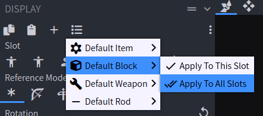

# Modeling Blocks in Blockbench for Minecraft Java Edition

## Creating a new Block

To start a new Block model in Blockbench:
1. `File` > `New` > `Java Block/Item`
2. Name it whatever you need
3. Parent model should be blank
4. Disable Ambient Occlusion, unless your block will have transparent parts
5. Set UV mode to `Per-Face UV`
6. Texture size should be 16 x 16

**You aren't done yet!** By default, the display settings for a model created in Blockbench are unset, which will make
the block appear too large when held by the player. The solution is to click the `Display` tab and modify it as-needed.
**You don't need to "guess" the settings for a block; simply apply the default block preset TO ALL SLOTS as shown in the screenshot
below:**

## Texturing a block

### Blocks using the same texture on all faces

This sections covers how you texture things like stone or sand (from vanilla Minecraft) using Blockbench.

To create the base texture that will be reused on every face:
1. Create a new texture
2. **For `Type`, set to `Blank`** 
   * Important part
   * Makes it so Blockbench will ignore your model's UVs when generating the "shape" of the texture template
   * Instead, it will generate a rectangular texture template with whatever dimensions you specify in the next step
3. Resolution should be 16 x 16
4. Set the color to whatever you need it to be (this is just the "starting" color)
5. Confirm

Once you have the base texture created, right-click it and select `Apply to Untextured Faces`, then:
1. Click the `Paint` tab (top-right)
2. Start drawing on the texture
    * Your changes should apply to all faces simultaneously since they are all using the same base texture
