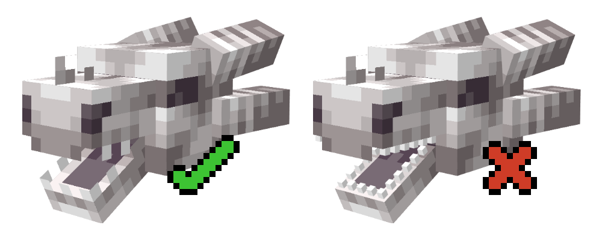
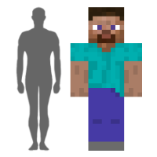
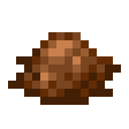
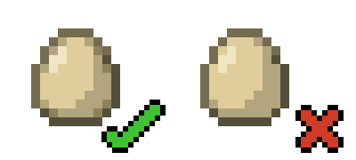
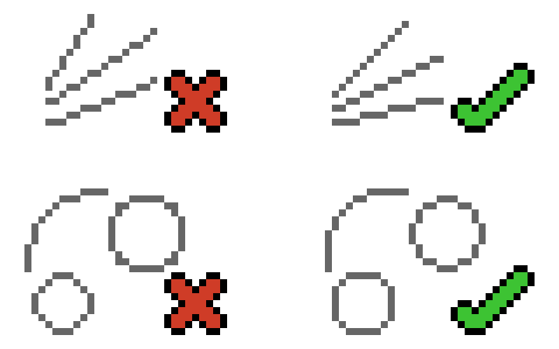
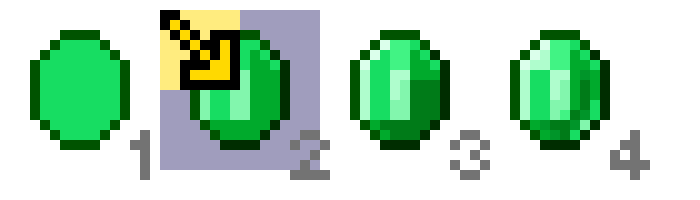

# [Minecraft Style Guide](https://www.blockbench.net/wiki/guides/minecraft-style-guide)

## General notes

* Element count should be as low as possible while still accurately depicting the object in question
* Use planes (elements with only 2 faces) where possible
  * Recall the brewing stand; the "arms" are textured planes
* Don't use "mixels" (pixels with higher resolution than Minecraft normally has) - it looks bad in most cases
  * There are some cases in Minecraft where these are used for inflated models, but it's not a common occurrence

Example of "mixels" - **don't use these - just an example of what to avoid:**

* Note the teeth in this image; they are far too high-definition in the right image

## Size & Proportions

Note these facts:
* A Minecraft block is 16x16x16 pixels
* A Block represents a cubic meter
    * This means a pixel is `~6.25 cm` long

When modeling, use appropriate dimensions as a guide for everything except for when doing so would break from the Minecraft aesthetic,
or if the object in question is too small to accurately model (for example, Minecraft Bees are not proportionate on purpose
so that they are recognizable).

Additionally, the Minecraft player model is far bulkier than an actual human body; keep this in mind.

Human-to-Steve ratio:

## Shading

* Pixel placement needs to be deliberate
* Use purposefully-restricted palettes and use of drawing tools without smoothness (such as a Pencil)
* Anti-aliasing (AA)
  * Method of manually-smoothing out the transition between shapes by placing differently-colored pixels on the border
  * Be careful not to go too crazy with AA as it can lead to "banding", which makes the pixel grid more apparent to the 
  viewer than the object it's meant to represent
* Dithering
  * A method of transitioning between two pixel clusters by intersecting their pixels in a certain pattern
  * Be careful not to go too crazy with dithering
    * It can make models look unnecessarily chaotic
    * It can also lead to the same issue as "banding", where the pixel grid is more apparent than the object represented

Dithering - **use appropriately**:

Anti-Aliasing:

* Border is too dark in the incorrect image, removing the illusion of "roundness"

## Lines and Shapes

* Straight lines must have a consistent step (see below)

Line examples:

## Creating item textures

All items fit within a 16x16 grid, no exceptions.

This is the process recommended by Blockbench when creating a new item texture:
1. Start by drawing the shape of the item using a midtone. Give it a significantly darker outline.
2. Add a highlight and a shadow
   * Item textures are shaded with the light source imagined as coming from the top left corner. Shade the outline accordingly.
3. Add the rest of the palette (more highlights and shadows).
4. Add in surface properties. In this example, the item is translucent and smooth. In other cases, the properties could be roughness, cracks, folds, dirtiness...

Their given example uses an emerald texture created in the following steps:

## Creating Block Textures

**Block textures need to look good both on their own and when placed next to each other.**

* Placing several tiles next to each other is called "Tiling"
  * **If a portion of the (individual) texture visibly repeats, then it needs to be fixed**
  * Preview tiling in Blockbench by creating a 3x3 wall of blocks
* **Check tiling before doing too much shading**
  * An early version of the texture with 2 or 3 shades is enough
  * Regularly-check tiling throughout the texturing process for blocks

## Creating entity texures

Entity textures have a special set of rules and guidelines. Mainly, the top and front of the entity need to be brighter 
than the bottom and back of it.

The general steps recommended by Blockbench for creating Entity texures are:

1. Generate a texture template to make the texturing process easier. Blockbench automatically maps the elements too.
2. Sketch the color distribution, add a shadow and a highlight.
3. Add more shades to the palette.
4. Define the material by editing the relative position of clusters of certain shades. Get rid of banding and any other shading artifacts from the previous steps.
